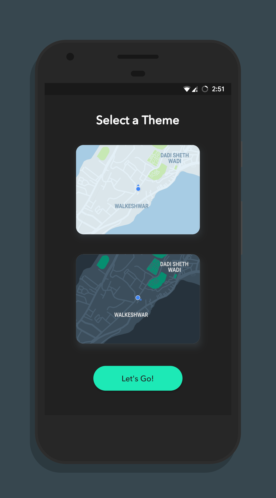
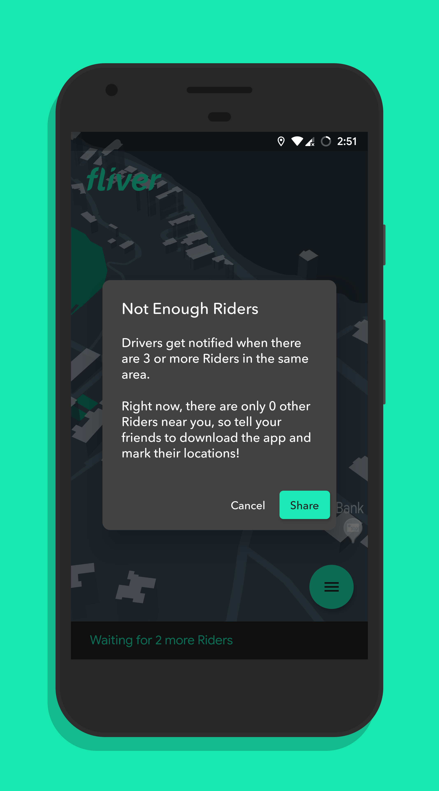
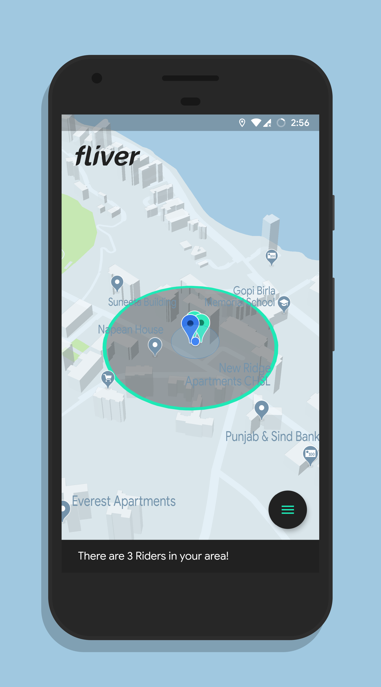
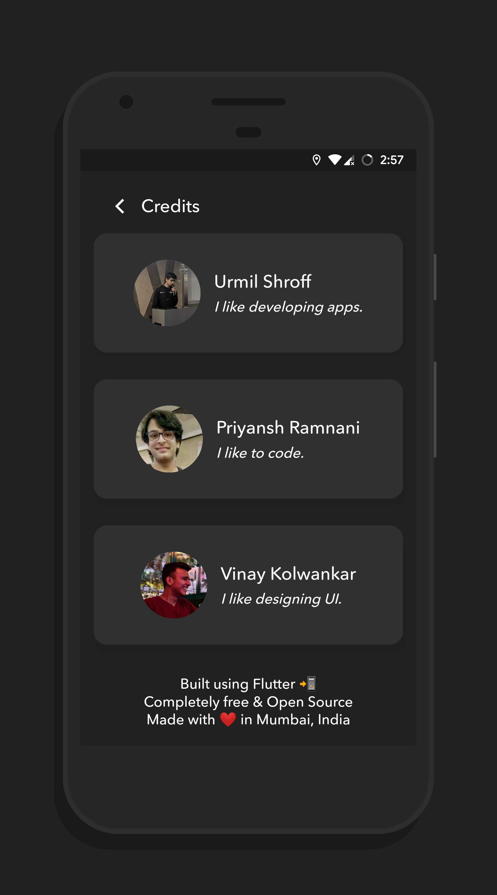

# Fliver Rider for iOS & Android

Fliver is a smartphone app to cater to the gross mismanagement of autorickshaw services in India. When you need an autorickshaw, you can simply open the app and mark your location. When there are 3 or more Riders in the same area, Drivers get notified and can view the areas of high demand, and accordingly come to pick Riders up.

The entire project is open source and free of charge. There are no additional costs for Riders besides for the regular metered rickshaw fare, and there is no commission that Drivers need to pay. Fliver is a completely non-profit project, created to benefit Indian citizens.

This is the Rider app repository for Riders to mark their locations and notify a Driver. It is part of the Final Year Project of three Computer Engineering students.

## Screenshots

    

## Building

**Important:** this project contains certain files that are encrypted due to the use of API keys, which is why it will not build directly on your machine. Please refer to [ENCRYPTION.md](ENCRYPTION.md) for more information.

To build and run the app on your device, do the following:

-   Install Flutter by following the instructions on their [website](https://flutter.dev/docs/get-started/install/).
-   Clone this repo to your local machine using `git clone https://github.com/fliverdev/rider.git`.
-   Replace all the encrypted files with your own as explained in [ENCRYPTION.md](ENCRYPTION.md).
-   Connect your devices/emulators and run the app using `flutter run` in the root of the project directory.

**Note:** you can also run it in release mode using `flutter run --release` to improve performance and stability, however, debugging features will be disabled.

## Contributing

Please read the [CONTRIBUTING.md](CONTRIBUTING.md) file for more details on how to contribute.

## Credits

This project is primarily developed by a bunch of Computer Engineering students at NMIMS's MPSTME:

-   [Urmil Shroff](https://github.com/urmilshroff)
-   [Priyansh Ramnani](https://github.com/prince1998)
-   [Vinay Kolwankar](https://github.com/vinay-ai)

Take a look at the entire list of [contributors](https://github.com/fliverdev/rider/graphs/contributors) to see who all have helped with the project via pull requests.

## Legal

This project is licensed under the GNU GPL v3 - see the [LICENSE](LICENSE) file for details. Also view our [privacy policy](PRIVACY_POLICY.md).
